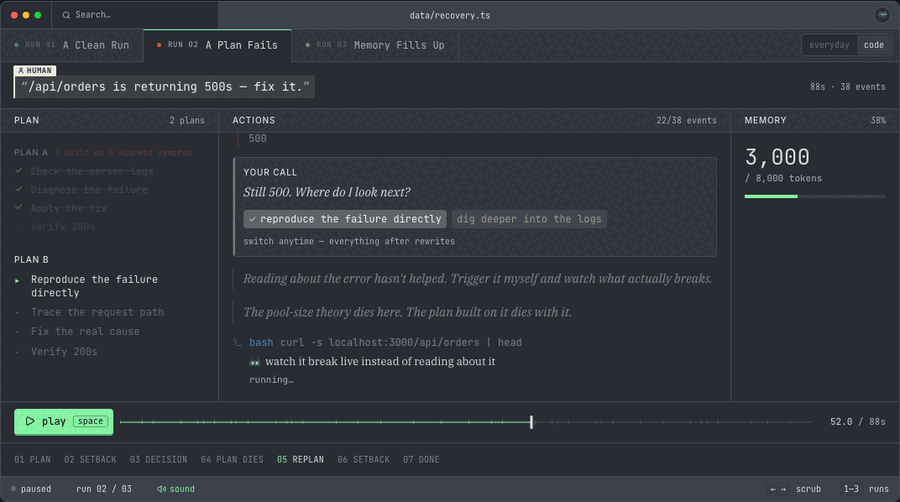

# How Agents Think

How Agents Think is a single-page site that teaches how AI agents work by
letting you watch one think. Three hand-scripted agent runs play out inside
a terminal-style window with a plan, tool calls, a memory gauge, and inner
thoughts, all on a timeline you can scrub like a video. It is live at
[howagentsthink.com](https://howagentsthink.com).



**Project status: Shipped.** All three runs, the choice branches, and the
finale are done. Remaining changes are copy and pacing fixes.

**Why build this?** Most explanations of AI agents are either marketing or
papers. I wanted the thing itself to be visible: the loop, the tool calls,
the memory filling up, the plan dying and getting rebuilt. After one run
(about a minute) you can tell another person one true thing about how
agents work. After all three you know the real vocabulary: agent, tool,
agentic loop, hallucination, context window, compacting.

**Why is the whole UI a pure function of time?** Everything on screen
renders from `stateAt(scenario, ms, choices)`. There is no accumulated
animation state anywhere. This is the design decision the rest of the site
falls out of: the timeline can be scrubbed to any millisecond and the
screen is always correct, and dragging backward is real. The later agent
doesn't exist yet, including the ending.

## How it works

**Runs are data, not recordings.** Each run is a hand-written script in
`data/*.ts`, a list of timestamped events (plan, tool_call, thought,
choice, compact, done). Every everyday run has a code twin that shares the
same timing skeleton, lesson, and verdict, so the same story can be watched
as "what's in my fridge?" or as a failing test suite.

**Motion is closed-form.** Springs are evaluated analytically at any `ms`
(see `lib/spring.ts`), so scrubbing, playing, and jumping all produce the
exact same frames. The few wall-clock exceptions, such as text entrances,
are documented where they live.

**The scripts are tested.** `lib/timeline.test.ts` enforces the mechanics:
narration length caps, token budgets, twin symmetry, branch integrity, one
voice per beat.

## Development

```sh
npm install
npm run dev     # http://localhost:3000
npm test        # timeline + spring tests
npm run build
npm run smoke   # real-browser smoke test against a prod build
```

Design notes live in [`docs/`](docs/), including the
[curriculum](docs/curriculum.md), which lists the facts the site teaches
and the rules every line of copy has to pass.
